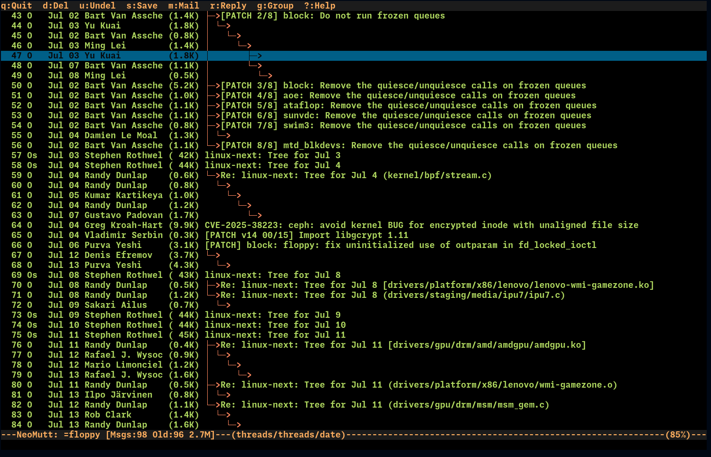
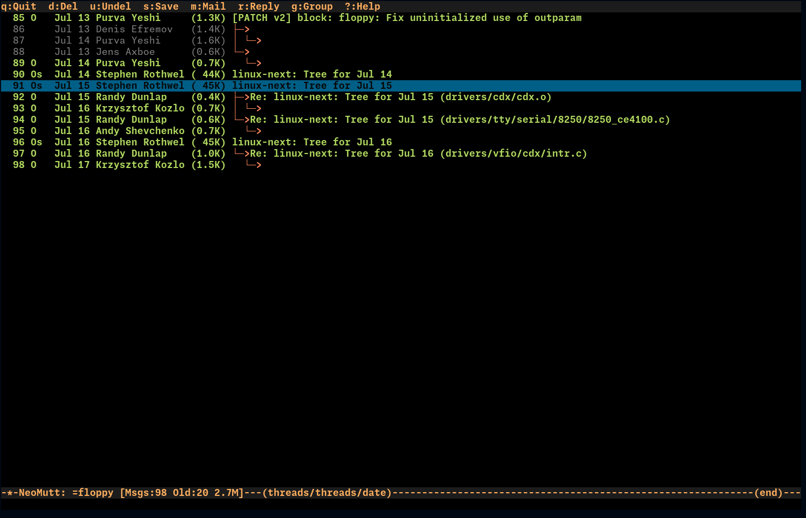
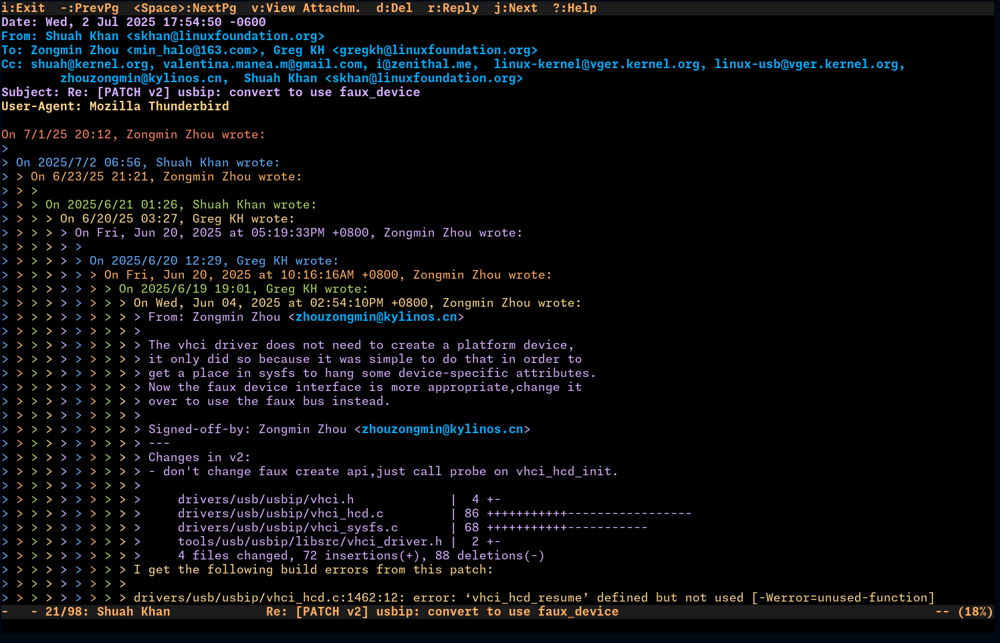
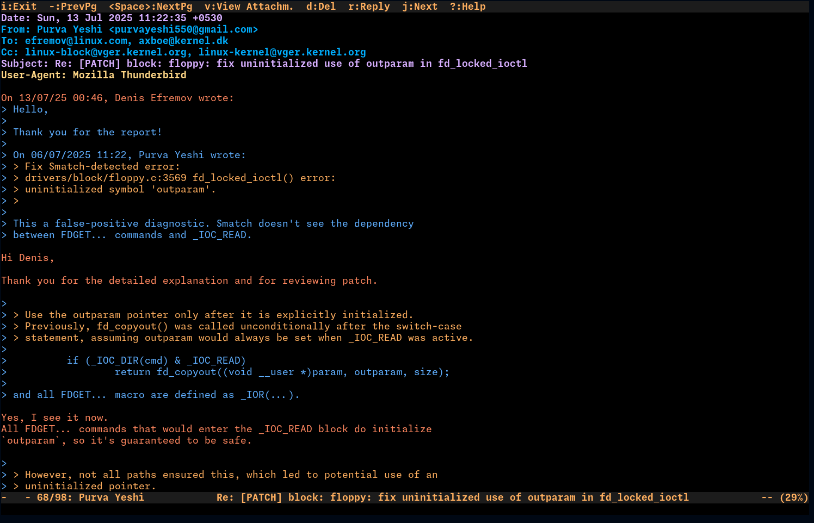

# Neomutt-ayu
---
A colorscheme for Neomutt based on [neovim-ayu](https://github.com/Shatur/neovim-ayu)

## Screenshots
---

## Installation
---
Include `colors/ayu-dark-256.neomuttrc` as part of your `~/.mutt/muttrc` file.

    $ mkdir -p ~/.mutt
    $ cd ~/.mutt
    $ git clone https://github.com/gopi487krishna/neomutt-ayu.git
    $ echo 'source ~/.mutt/neomutt-ayu/colors/ayu-dark-256.neomuttrc' >>~/.mutt/muttrc

## Contributing
---
Send me a PR!

## TODO

- [ ] Add Light theme
- [ ] Add Mirage theme

